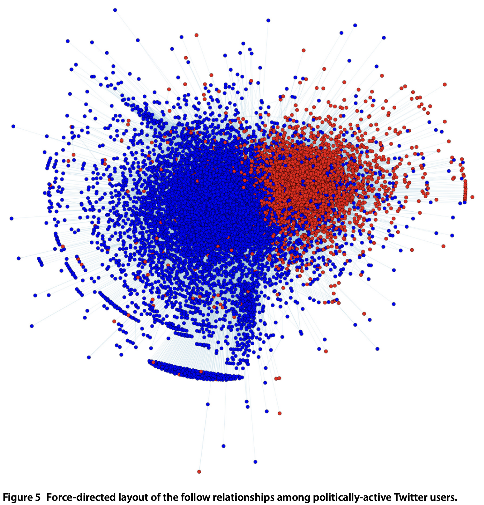
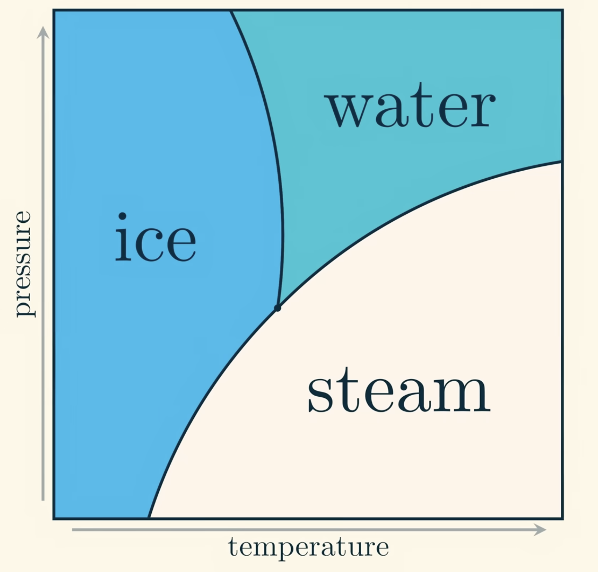

# Week 09 — Network Science

> **Announcements**
> - Long Night of the Sciences: 26 June, from 5 pm.
> - The next two classes will be online.

# Readings and Concepts

**Structures**
- Random network (Erdős–Rényi)
- Small-world network (Watts–Strogatz)
- Power law & preferential attachment (Barabási–Albert)

**Measurements**
- **Clustering** — the fraction of a node's neighbors that are also connected to each other (% of mutual friendships).
- **Degree of separation** between two nodes — the shortest path length between them (computed via BFS).

**Dynamics & Properties**
- Strength of weak ties
- Game-theoretic cooperation + network structure

## Issues within network science

- **Network structure**: diameter of the web, applications of different graph types.
- **Network dynamics**: effective spreading, immunization (of disease, misinformation, ideas).
- **Network robustness**: tolerance to random breakdown or targeted attack.
- **Science of cities**: mobility, navigation.
- **Science of science**: measuring disruptiveness, collaboration patterns.
- **Social networks**.

### Tipping point: small-world + prisoner's dilemma

- **Strogatz**: clusters and repeated iterations are important for cooperation.
- **Duncan Watts**: cooperation is as likely to emerge in a clustered network as in a random network.
- Looking closely, the distribution of results is bimodal, so the *net* effect makes the networks look the same.
- Rewiring helps the overall results become more cooperative.
- Sensitivity to initial conditions.

### Disease-spreading model

- Veritasium simulation: https://www.veritasium.com/simulation2
- [SIR model](https://en.wikipedia.org/wiki/Compartmental_models_(epidemiology)#The_SIR_model)

### Social networks



[Political polarization on Twitter](https://ojs.aaai.org/index.php/icwsm/article/view/14126)


[Right and left, partisanship predicts (asymmetric) vulnerability to misinformation](https://arxiv.org/abs/2010.01462)

### Science-of-science application

[Kim et al_Uncovering Simultaneous Breakthroughs
with a Robust Measure of Disruptiveness](images/Kim_disruptiveness_05292026.pdf)

### More tipping points

A **phase transition** is a collective tipping point where gradual changes in a parameter produce a sudden change in the system's macroscopic state.

- **Phase** = equilibrium behavior — once the system has had time to settle, it can be described by only a few parameters.
- **Phase transition** = a discontinuity in equilibrium behavior.



(Figure from [Simulating and understanding phase change](https://www.youtube.com/watch?v=itRV2jEtV8Q))

# Network Science, Dynamical Systems & Complexity Science

## Fractals & complexity

Simple local rules → complex behaviors.

- [Emergent Complexity](https://www.youtube.com/watch?v=0HqUYpGQIfs)

## Power laws are scale-free

[Scale-free network](https://networksciencebook.com/chapter/4#power-laws)

$$P(x) \sim x^{-\alpha}$$

This means the quantity $x$ has no typical scale. Small events are common, large events are rare, but in the ideal case there is no characteristic cutoff size.

A fractal looks similar when you zoom in or out. A power law behaves similarly: if you rescale $x$, the distribution keeps the same shape:

$$P(cx) \sim (cx)^{-\alpha} = c^{-\alpha}x^{-\alpha}$$

The only thing that changes is a constant multiplier $c^{-\alpha}$; the basic form remains the same. Power laws are scale-invariant, or **scale-free**.

## Dynamical systems

Network science is closely related to dynamical physical systems, but the two are not the same. The link came about when researchers realized that many real physical, biological, and social systems are best understood as large collections of interacting units — where the topology of interaction is neither a simple lattice nor fully random, and where that topology strongly controls the system's collective dynamics.

```text
Network science      studies the structure of connections.
Dynamical systems    study how states change over time.
Network dynamics     studies how changing states evolve on connected structures.
```

A network gives you the **structure** (wiring diagram); a dynamical system gives you the **dynamics** (rules of motion).

### 1. The core link: dynamics on a graph

In a physical dynamical system, you often have many interacting parts:

```text
oscillators, spins, neurons, atoms, people, power stations, species, genes
```

Each part has a state, and that state changes depending on its own behavior and the behavior of its neighbors. A general form is:

$$\frac{dx_i}{dt} = F(x_i) + \sum_j A_{ij}\,G(x_i, x_j)$$

| Symbol | Meaning |
|---|---|
| $x_i$ | state of node $i$ |
| $F(x_i)$ | node's own dynamics |
| $A_{ij}$ | network adjacency matrix |
| $G(x_i, x_j)$ | interaction between connected nodes |

Network science enters mainly through the adjacency matrix $A_{ij}$: it tells you who interacts with whom.

| System | Node | Edge | Dynamics |
|---|---|---|---|
| Power grid | generator/substation | transmission line | synchronization, cascading failure |
| Brain | neuron/brain region | synapse/functional link | firing, oscillation, spreading activity |
| Epidemic | person/city | contact/travel route | infection spread |
| Ecosystem | species | predation/mutualism | population change |
| Social system | person | friendship/contact | opinion spread, contagion |
| Spin system | spin/site | physical coupling | phase transition, magnetization |

This is why network science became attractive to physicists: many physical systems are not just "many particles," but **many interacting units with nontrivial interaction topology**.

### 2. Relation to the Watts–Strogatz model

The Watts–Strogatz paper is explicitly about this connection — its title is **"Collective dynamics of 'small-world' networks."** The point was not just that some graphs have short path lengths; the deeper point was that the **topology of connections changes the dynamics**.

They showed that small-world coupling can improve or alter **signal propagation, computational power, synchronizability, and disease spreading**. Their examples included the *C. elegans* neural network, the western U.S. power grid, and the film-actor collaboration graph.

The model came from asking:

```text
What happens to collective dynamics when a system is neither a regular lattice
nor a completely random graph?
```

That is a very physical question. It resembles statistical mechanics: interpolate between order and disorder, then study how system behavior changes.

### 3. How & why physicists entered network science

The link came from several overlapping traditions.

First, **statistical mechanics** already studied many-body systems — magnets, gases, fluids, phase transitions. These systems involve many interacting components, so physicists already had tools for studying collective behavior.

Second, older **graph theory and random-graph theory** existed, especially through Erdős–Rényi random graphs. But many real systems were described well by neither regular lattices nor purely random graphs.

Third, in the late 1990s, **empirical data on real networks** became easier to collect: the internet, the World Wide Web, citation networks, biological networks, power grids, social networks. This made it possible to compare mathematical models with actual large-scale networks.

Two landmark papers helped launch modern network science:

- **Watts and Strogatz (1998)** showed that many networks combine **high clustering** with **short average path length**, and that this affects collective dynamics.
- **Barabási and Albert (1999)** showed that many large networks have **scale-free**, power-law-like degree distributions, and proposed growth plus preferential attachment as a mechanism. They framed networks such as genetic networks and the World Wide Web as systems whose topology emerges through self-organizing processes.

That is why modern network science has a strong physics flavor: it studies large systems, emergent patterns, scaling laws, robustness, phase transitions, synchronization, percolation, and criticality.

### 4. How close are these fields?

Many important network-science topics are essentially dynamical-systems or statistical-physics topics on graphs:

| Network-science topic | Physical / dynamical-system connection |
|---|---|
| Synchronization | coupled oscillators, power grids, neurons |
| Epidemic spreading | reaction-diffusion, contagion dynamics |
| Percolation | phase transitions, connectivity thresholds |
| Cascading failures | nonlinear stability, critical transitions |
| Community structure | modular organization, metastable dynamics |
| Scale-free networks | scaling laws, universality, self-organization |
| Small-world networks | disorder, shortcuts, transport, synchronization |
| Adaptive networks | coevolution of topology and state |

```text
Network science asks:    How does topology affect behavior?
Dynamical systems ask:   How do states evolve over time?
Together they ask:       How does the pattern of connections shape collective dynamics?
```

#### The same dynamics can behave very differently on different networks

For example, imagine an epidemic process:

```text
Regular lattice:
infection spreads slowly, mostly locally.

Random network:
infection can jump far, spreading quickly.

Small-world network:
mostly local spread, but a few shortcuts drastically reduce distances.
```

That is exactly why small-world networks matter. A tiny amount of disorder can keep clustering high while dramatically shortening path lengths, which changes how signals, diseases, synchronization, or failures propagate.

**But network science is broader and more interdisciplinary than physics.** It also draws from sociology, graph theory, computer science, biology, economics, and data science.

- [Birds of a feather: Homophily in social networks](https://www.annualreviews.org/content/journals/10.1146/annurev.soc.27.1.415)
- Emergence of Computational Social Science as a field.

### Some social-science examples

- [Optimal network modularity for information diffusion](https://arxiv.org/abs/1401.1257)
- [Emergence of simple and complex contagion dynamics from weighted belief networks](https://www.science.org/doi/full/10.1126/sciadv.adh4439)


More and more classic models are being challenged as new knowledge emerges and we gain better tools to map networks with more nuance. We can now characterize opinions — through surveys or social media — at much higher granularity.

- [Complex contagions and the weakness of long ties](https://www.journals.uchicago.edu/doi/abs/10.1086/521848)
- [Emergence of Stereotypes and Affective Polarization from Belief Network Dynamics](https://arxiv.org/pdf/2604.10251)

A useful tension to keep in mind:

```text
Realism            <--->   Explainability
LLMs               <--->   Models with few parameters (e.g., probability of infection)
```

# Appendix

### Methods in CSS

- **Simulation**: [Quantifying the vulnerabilities of the online public square to adversarial manipulation tactics](https://scholar.google.com/citations?view_op=view_citation&hl=en&user=tng76dgAAAAJ&citation_for_view=tng76dgAAAAJ:_FxGoFyzp5QC)
- **Experiment**
- **Observation**

### Critical & supercritical regimes

Critical and supercritical regimes describe where a system sits relative to a threshold or critical point.

```text
subcritical    →    critical    →    supercritical
below threshold     at threshold     above threshold
```

#### 1. Critical regime

The **critical regime** is the region near the tipping point where the system is balanced between two qualitatively different behaviors. At the critical point, small changes can produce very large effects.

For example, in a network epidemic model, each infected node infects, on average, $R$ other nodes. If $R = 1$, the system is **critical**: each infected node replaces itself with about one new infected node. The outbreak neither clearly dies out nor clearly explodes — it can produce cascades of many different sizes.

At criticality, systems often show:

| Feature | Meaning |
|---|---|
| High sensitivity | Small changes can have large effects |
| Long-range correlations | Distant parts of the system become connected in behavior |
| Scale-free fluctuations | No single typical event size |
| Power laws | Many small events, fewer large ones, no characteristic scale |
| Tipping behavior | The system is near a qualitative transition |

In network terms, the critical regime is where a **giant component**, a large epidemic, global synchronization, or a cascading failure is just about to appear.

#### 2. Supercritical regime

The **supercritical regime** is above the critical threshold. In an epidemic example, $R > 1$: each infected node infects more than one new node on average, so the outbreak can grow through the system.

```text
R < 1  → subcritical:   outbreak dies out
R = 1  → critical:      borderline
R > 1  → supercritical: outbreak can spread widely
```

#### 3. Network example: random graph

Suppose we build a random network where each node has, on average, $\langle k \rangle$ connections. There is a famous transition around $\langle k \rangle = 1$:

| Regime | Meaning |
|---|---|
| $\langle k \rangle < 1$ | Subcritical: only small, disconnected clusters |
| $\langle k \rangle = 1$ | Critical: clusters of many sizes appear |
| $\langle k \rangle > 1$ | Supercritical: a giant connected component appears |

So in the supercritical regime, a macroscopic fraction of the network becomes connected.

#### 4. In plain language

Imagine a forest fire:

```text
Too few trees:
fire burns out quickly.

Just enough trees:
fire behavior is unpredictable and highly sensitive.

Many trees:
fire can spread across a large region.
```

That maps to: subcritical → critical → supercritical.

#### 5. Why criticality matters

Critical regimes are interesting because they are where systems are most responsive and most fragile.

| System | Critical point separates |
|---|---|
| Epidemic | dying out vs. spreading |
| Network connectivity | isolated clusters vs. giant component |
| Magnet | disordered spins vs. magnetization |
| Brain dynamics | weak local activity vs. runaway excitation |
| Power grid | stable operation vs. cascading blackout |
| Financial system | local losses vs. systemic crisis |

**Key idea.** A **critical regime** is near the threshold where collective behavior changes dramatically. A **supercritical regime** is beyond that threshold, where the new large-scale behavior has already emerged.

### Weng et al. — Virality

#### Do ideas spread like diseases?

Weng, Menczer, and Ahn study whether Twitter hashtags spread like **complex contagions** or **simple contagions**, and whether early community-level spreading patterns can predict later virality. Their conclusion is nuanced: **most hashtags are trapped inside communities, consistent with complex contagion, but the rare viral hashtags spread across many communities, resembling simple epidemic contagion.** They then show that early measures of community dispersion predict later popularity better than early-popularity-only baselines.

#### Data and setup

The authors use a 10% sample of all public English tweets from 24 March to 25 April 2012, containing over 121 million tweets, 14.6 million users, and 10.4 million hashtags. Each hashtag is treated as a "meme." The main social network is built from reciprocal following ties among 595,460 randomly selected users, as an undirected, unweighted graph; retweet and mention networks serve as robustness checks. Communities are detected mainly with Infomap, with link clustering as a robustness check.

Many analyses focus on new memes — hashtags with fewer than 20 tweets in the previous month — to reduce contamination from already-established hashtags. For early-stage measures, they use only the first 50 tweets of each hashtag, so the predictors are not mechanically caused by later popularity.

#### Claim 1. Communication is more concentrated within communities than across them

Twitter communication is not indifferent to community structure: people communicate more inside communities than across them, consistent with community "trapping."

Communities are first detected from the **unweighted network structure**, not from communication volume. Communication activity is then overlaid onto that partition.

| Measure | Construction | Interpretation |
|---|---|---|
| Edge weight `w` | Frequency of communication between two connected users (retweets or mentions) | How much information flows over a social tie |
| Avg. intra-community edge weight | Average weight on edges whose endpoints are in the same community | Internal communication intensity |
| Avg. inter-community edge weight | Average weight on edges whose endpoints are in different communities | Cross-community communication intensity |
| User focus | Fraction of a user's communication directed to neighbors inside vs. outside their community | Whether users direct attention inward or outward |

**Test — intra- vs. inter-community communication.** If meme diffusion ignored communities, intra- and inter-community links should carry similar communication volume. Instead, intra-community links carry more messages, and users interact more with same-community neighbors. The results are statistically significant at **p = 0.001** and robust to alternative community-detection methods.

→ This supports the premise that communities are meaningful channels for diffusion. It does not yet prove virality prediction; it establishes that the network has a community-based communication structure that could affect diffusion.

#### Claim 2. Most memes behave like complex contagions (trapped inside communities)

Non-viral memes tend to remain concentrated within communities, consistent with complex contagion, reinforcement, and homophily.

**Measurement.** For each hashtag `h`, measure how concentrated its early usage and adoption are across communities.

| Measure | Construction | High value means |
|---|---|---|
| Usage-dominant community | The community producing the most tweets containing `h` | Where the hashtag is most used |
| Usage dominance `r(h)` | Share of all early tweets with `h` from the usage-dominant community | Tweet activity is concentrated |
| Usage entropy `Ht(h)` | Entropy of the distribution of tweets with `h` across communities | Low = concentration; high = broad spread |
| Adoption dominance `g(h)` | Share of adopters of `h` in the community with the most adopters | Adoption is concentrated |
| Adoption entropy `Hu(h)` | Entropy of adopters across communities | Low = adopters are clustered |

Dominance and entropy are normalized against the random-sampling baseline `M1`, producing **relative dominance** and **relative entropy**, computed using only the first 50 tweets of each meme.

**Baseline models.** Real memes are compared against four toy models:

| Model | What it includes | Purpose |
|---|---|---|
| M1: random sampling | No network, no reinforcement, no homophily | Null model: adoption is random |
| M2: simple cascade | Network structure only | Simple-contagion baseline |
| M3: social reinforcement | Network + reinforcement | Complex-contagion mechanism |
| M4: homophily | Network + community-constrained adoption | Community-preference / homophily mechanism |

- In **M2**, a cascade starts from a seed; with probability 0.85 an infected node causes a neighbor to adopt, and with probability 0.15 the process restarts from a new seed.
- In **M3**, the next adopter is the user with the maximum number of infected neighbors (reinforcement).
- In **M4**, adoption is constrained to neighbors in the same community (homophily / community preference).

**Test — plot relative concentration against meme popularity and compare to the four baselines.** Non-viral memes show concentration similar to, or stronger than, M3 and M4. This is evidence that ordinary memes are trapped by community structure and behave more like complex contagions than simple epidemics.

→ The typical hashtag does not diffuse freely across the network. It tends to remain within communities, where repeated exposure and shared interests are more likely.

#### Claim 3. Viral memes behave more like simple contagions

Viral memes are *less* trapped by communities. They spread across many communities, more like diseases or simple cascades.

**Measurement.** The same concentration measures are reused — usage dominance, adoption dominance, usage entropy, adoption entropy. Viral memes should have **lower dominance** and **higher entropy** than community-trapped memes, because they are distributed more broadly.

A direct social-reinforcement measure is also constructed:

| Measure | Construction | Interpretation |
|---|---|---|
| Average exposure `N(h)` | For each adopter of `h`, count exposures before adoption; average across adopters | Higher = stronger need for social reinforcement |
| Tweet-based exposure `Nt(h)` | Exposures counted by number of prior tweets seen | Reinforcement via repeated tweet exposures |
| User-based exposure `Nu(h)` | Exposures counted by number of prior adopting users | Reinforcement via multiple neighbors |
| Relative exposure | Exposure divided by the random-sampling baseline `M1` | Normalized reinforcement strength |

**Test.** For highly popular memes, empirical concentration resembles the **simple-cascade model M2**, not the reinforcement or homophily models M3 and M4. The exposure analysis agrees: viral memes require as little reinforcement as the simple-cascade baseline, whereas non-viral memes require exposure levels closer to the reinforcement or homophily baselines.

→ Virality is associated with **community permeability**. A meme that spreads beyond its initial community early is more likely to become viral. In the authors' framing, viral memes have broader appeal and require less local reinforcement.

#### Claim 4. Early community dispersion predicts future virality

Early cross-community spreading can forecast which memes go viral.

**Outcome variable.** Hashtags are ranked by either total tweets `T` or total adopters/users `U`. A meme is labeled viral if it exceeds a percentile threshold (e.g., 70th, 80th, or 90th) on tweet or adopter count.

**Predictor features.** All computed from the first 50 tweets.

| Feature group | Measure | Meaning |
|---|---|---|
| Early popularity | Number of early adopters | How many users produced the first tweets |
| Early reach | Number of uninfected neighbors of early adopters | Potential next-step audience |
| Community spread | Number of infected communities | How many communities already contain adopters |
| Community concentration | Usage entropy `Ht(h)`, adoption entropy `Hu(h)` | Whether activity/adoption is concentrated or dispersed |
| Interaction structure | Fraction of intra-community user interactions | Whether meme-related interactions stay within communities |

A **random forest** (500 trees, 4 random features per tree) is trained and evaluated with **10-fold cross-validation**. It is compared against two baselines: random guessing, and a **community-blind classifier** using the same method but with community-based features removed.

| Metric | Meaning |
|---|---|
| Precision | Of predicted viral memes, how many were actually viral |
| Recall | Of actual viral memes, how many were found |

The community-based model outperforms both baselines. For the most viral memes by users, at the 90th-percentile threshold, it is reported as about **7× more precise than random guessing** and **over 3× more precise than the community-blind model**; recall is **over 350% better than random guessing** and **over 200% better than the community-blind model**.

→ Community structure adds predictive information beyond early popularity alone. Early popularity helps, but early **cross-community penetration** is much more diagnostic of later virality.

#### Overall

The central insight: **virality is not just about how many people adopt early, but where those adopters sit in the network.** A hashtag that gets 50 early tweets inside one tightly knit community is less promising than one whose first 50 tweets appear across many communities. The first looks like a complex contagion with local reinforcement; the second looks like a simple contagion with broad transmissibility.

#### Limitations

The authors do not identify the semantic content of hashtags, so they cannot explain *why* some memes cross communities. They also treat hashtags as memes — convenient but imperfect, since hashtags can be ambiguous, reused, or tied to external events. Their observational data cannot fully separate social influence from homophily; the paper explicitly treats them together as mechanisms that increase community trapping.
